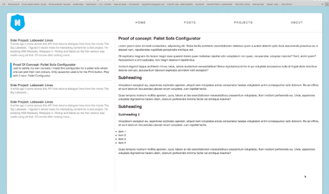

This experiment shows a way to create an app-like interface with the use of CSS Grid & CSS Flex-box.
<!-- <dl>
<dt>Project name</dt>
<dd>app interface</dd>
<dt>Website</dt>
<dd><a href="http://poc.nirusu.me/app/index.html">http://poc.nirusu.me/app/index.html</a></dd>
<dt>Tools</dt>
<dd>Visual Studio Code</dd>
<dt>Technologies</dt>
<dd>HTML, CSS</dd>
</dl> -->

<dl class="nh-def-list --horizontal">
<dt>Project name</dt>
<dd>app interface</dd>
<dt>Website</dt>
<dd><a href="http://poc.nirusu.me/app/index.html">http://poc.nirusu.me/app/index.html</a></dd>
<dt>Tools</dt>
<dd>Visual Studio Code</dd>
<dt>Technologies</dt>
<dd>HTML, CSS</dd>
</dl>
